# Coverity Disposition Tool

**Parent page:** Datalink Quality Dashboard  
**Space:** CNSDLK  
**Page type:** Tool user guide and download page  
**Current package:** `Coverity-Tool-Final-20260831.zip`  
**Manual document:** `Coverity_Tool_User_Manual.docx`

## Overview

The Coverity Disposition Tool is a Windows desktop utility for reviewing Coverity findings, checking each finding against local source code, recording reviewer decisions, and pushing final dispositions back to Coverity Connect.

The tool is intended for engineering review workflows where users need to:

- Pull defects from Coverity Connect.
- Run local disposition analysis against the matching source checkout.
- Review each CID with source context and suggested disposition.
- Accept or override decisions.
- Push approved dispositions back to Coverity Connect.

## Downloads

Attach the following files to this Confluence page and link them from this section.

| File | Purpose |
|---|---|
| `Coverity-Tool-Final-20260831.zip` | Final Windows package containing the executable and required runtime files. |
| `Coverity_Tool_User_Manual.docx` | Word user manual with screenshots and workflow explanation. |

## Package Contents

After extracting `Coverity-Tool-Final-20260831.zip`, users should see:

| Item | Description |
|---|---|
| `CoverityTool.exe` | Main desktop application. |
| `_internal` | Required runtime libraries. Keep this folder beside the executable. |
| `docs` | User manual, sample report, and sample source files. |
| `run_tool.bat` | Batch launcher for the packaged tool. |
| `CoverityTool.bat` | Alternate launcher. |
| `README.md` / `README.txt` | Short setup and troubleshooting notes. |

## Important Usage Notes

- Keep `CoverityTool.exe` and `_internal` in the same folder.
- Do not move only the `.exe` to another location; the app needs the bundled runtime files.
- Use the final package zip from this page, not older local builds.
- Source code is analyzed locally. The tool does not upload local source code.
- Coverity Connect login requires Honeywell network/SSO access and Coverity project permissions.

## End-to-End Workflow

1. If defects are not already in Coverity Connect, use **Commit Defects**.
2. Use **Pull from Coverity** to fetch current defects and create the Excel input file.
3. Select the report/Excel file, source root, and output folder in **Setup**.
4. Run **Start Disposition**.
5. Review findings in **Results** and **Full Detail**.
6. Accept valid suggestions or override with reviewer judgment.
7. Push final decisions using **CSV Push** or **Direct Push**.

## Screen Guide

### 1. Setup Page

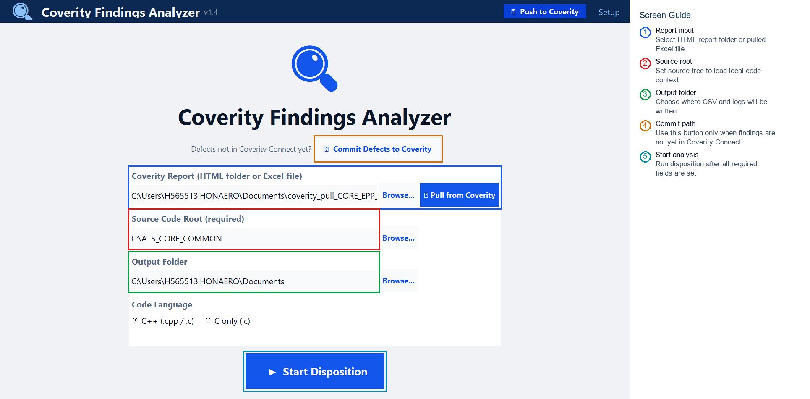

Use this page to select the input report or pulled Excel file, choose the matching source checkout, and define the output folder. Start analysis only after all required fields are populated.

### 2. Commit Defects Dialog

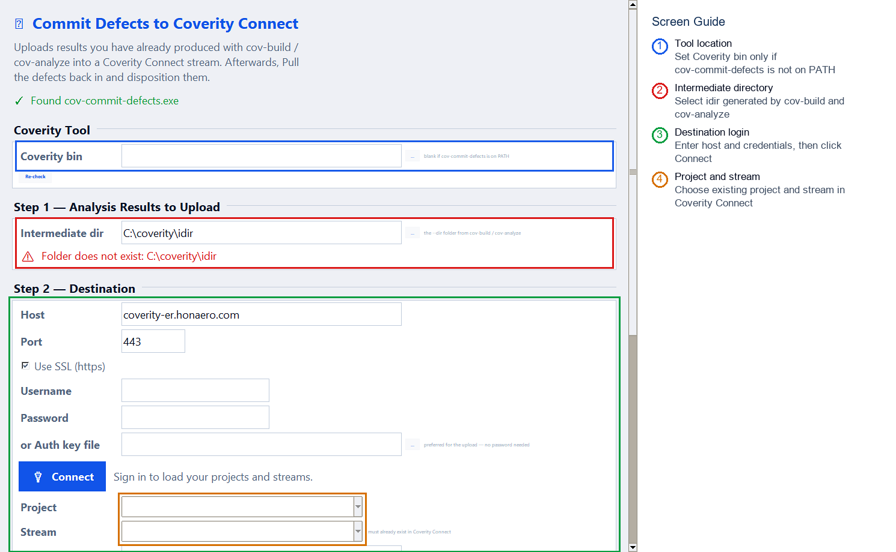

Use this dialog only when findings must be committed to Coverity Connect from an existing Coverity intermediate directory. Connect first, choose the project and stream, then commit after validation is clean.

### 3. Pull Defects Dialog - Top View

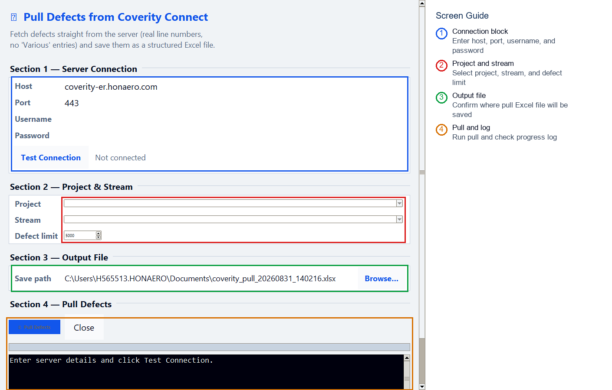

The top view contains server connection details, project/stream selection, defect limit, and output file path. Test the connection before selecting project and stream.

### 4. Pull Defects Dialog - Bottom View

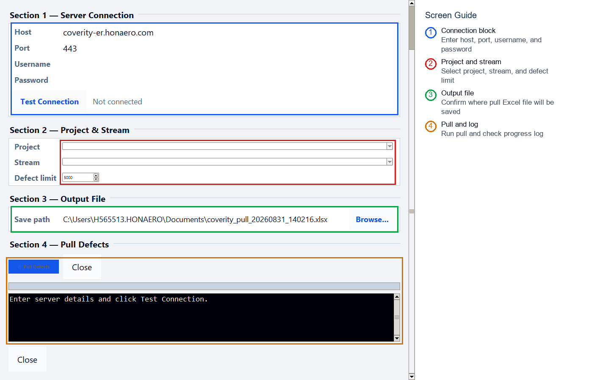

The bottom view contains the pull action, progress area, and log. Use this area to confirm whether the pull completed successfully or failed due to network, credential, or permission issues.

### 5. Analysis Progress

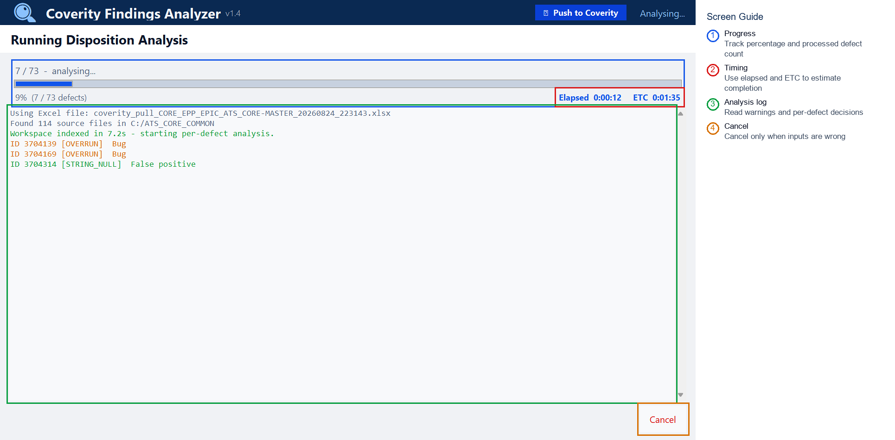

The progress page shows processed defect count, percentage, elapsed time, estimated completion time, and detailed analysis messages.

### 6. Results Page

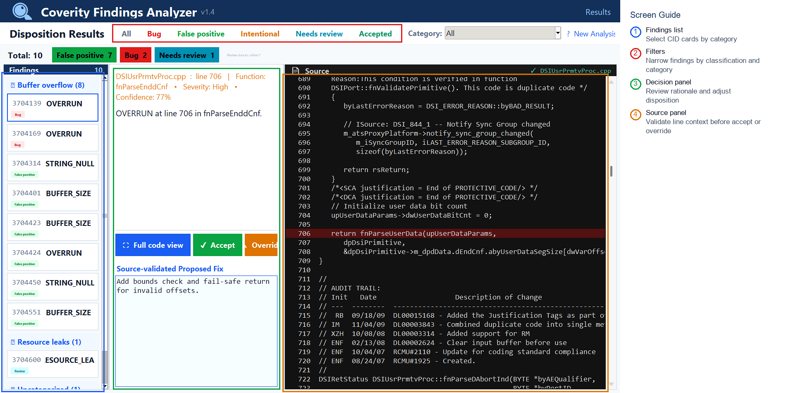

Use the Results page as the main review queue. Select each CID, review rationale and source context, then accept or override the suggested disposition.

### 7. Full Detail Window

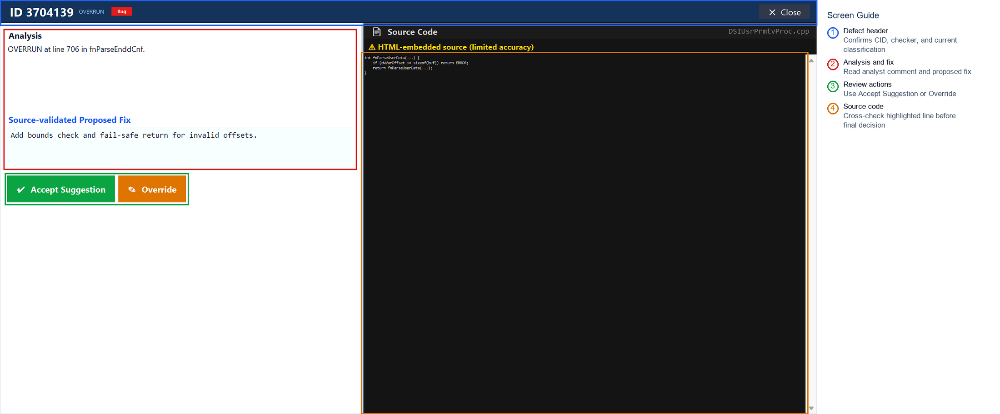

Use the Full Detail window for high-confidence review of one CID. Confirm the checker, classification, rationale, proposed fix, and highlighted source before making a final decision.

### 8. CSV Push Dialog - Top View

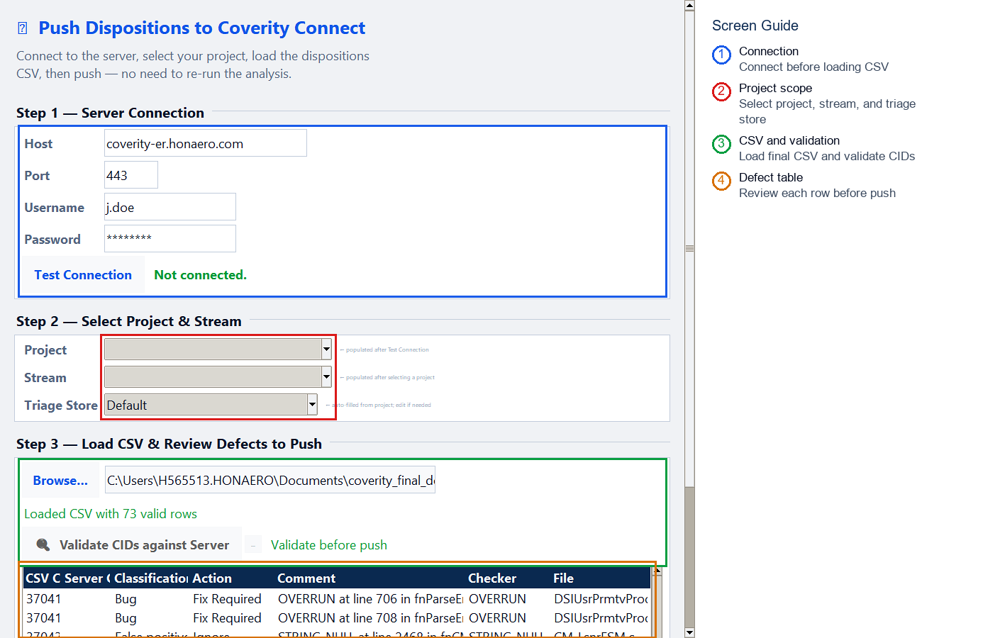

Use this view to connect to Coverity, choose project/stream/triage store, and load `coverity_final_decisions.csv`.

### 9. CSV Push Dialog - Bottom View

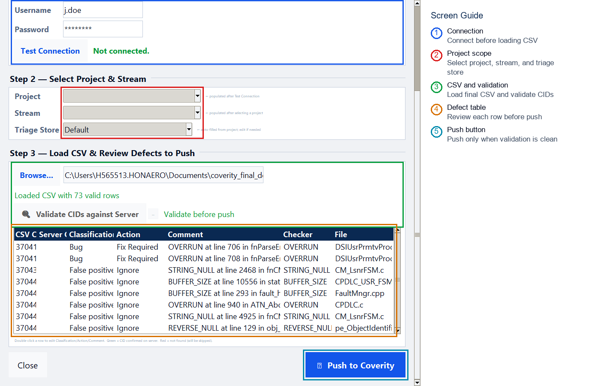

Use this view to validate CIDs, review rows, dry run if needed, and push final decisions to Coverity.

### 10. Direct Push Dialog - Top View

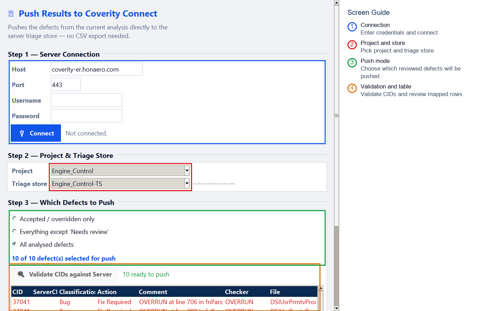

Use Direct Push when the current in-memory review results should be pushed without exporting and reloading CSV. Choose the push mode according to team policy.

### 11. Direct Push Dialog - Bottom View

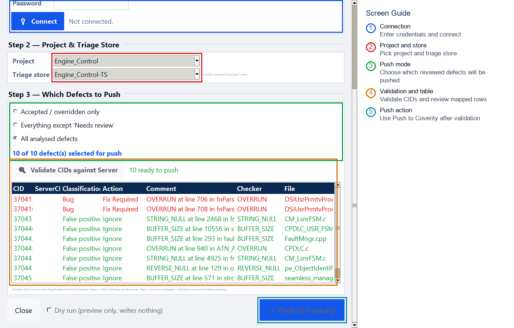

Use the lower Direct Push view to validate mapped CIDs, review selected rows, dry run, and submit dispositions.

## Output Files

| File | Description |
|---|---|
| `coverity_pull_<stream>_<timestamp>.xlsx` | Defects pulled from Coverity Connect. Use as Setup input. |
| `coverity_dispositions.csv` | Tool-generated suggestions for review. |
| `coverity_final_decisions.csv` | Reviewer-approved decisions for push. |
| `audit.jsonl` | Decision evidence and traceability log. |
| `*_pull_log.txt` | Pull diagnostics and troubleshooting log. |

## Troubleshooting

| Issue | Action |
|---|---|
| App does not open | Keep `CoverityTool.exe` and `_internal` together. Try `run_tool.bat`. |
| Cannot connect to Coverity | Verify VPN/network, host, port, username, password, and permissions. |
| No projects or streams visible | Confirm the user has access to the Coverity project and stream. |
| Results do not show local code | Verify Source Code Root points to the matching source baseline. |
| Push fails | Validate CIDs, confirm triage store, and check project/stream selection. |

## Support Information

For support, provide:

- Tool package version or zip name.
- Screenshot of the failing screen.
- Pull or push log message.
- CID, checker name, project, and stream.
- Whether the issue occurs during Pull, Analysis, Review, CSV Push, or Direct Push.
