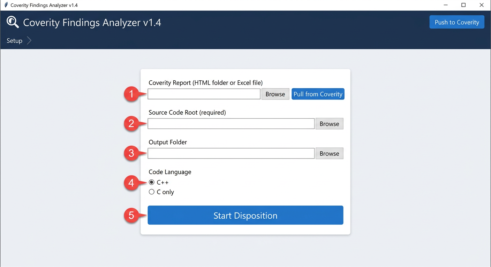
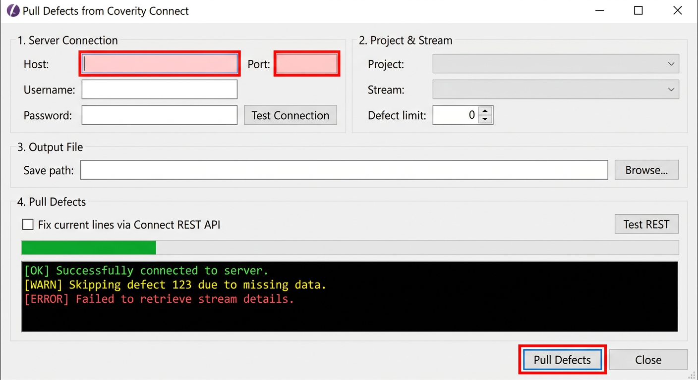
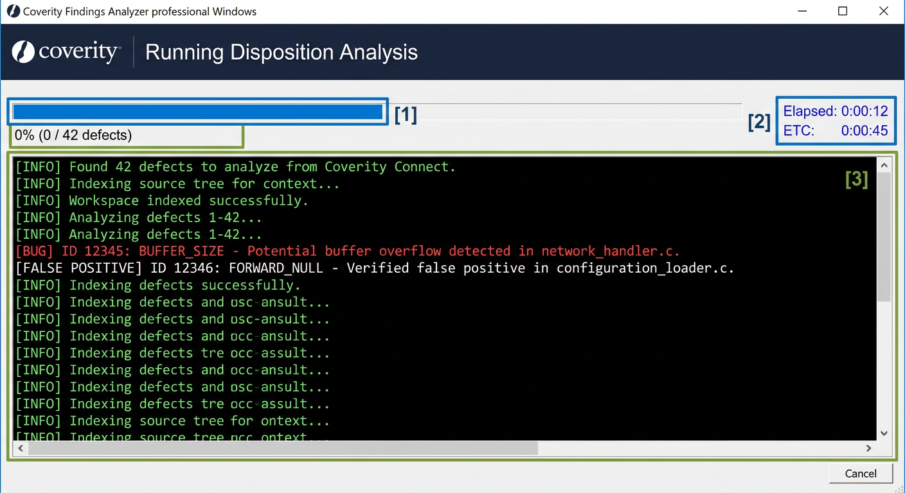
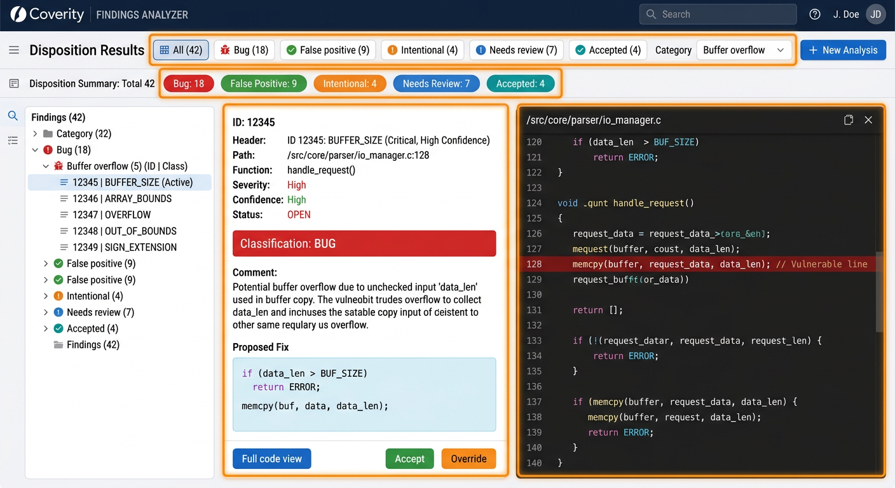
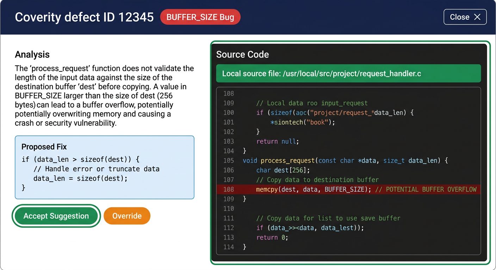
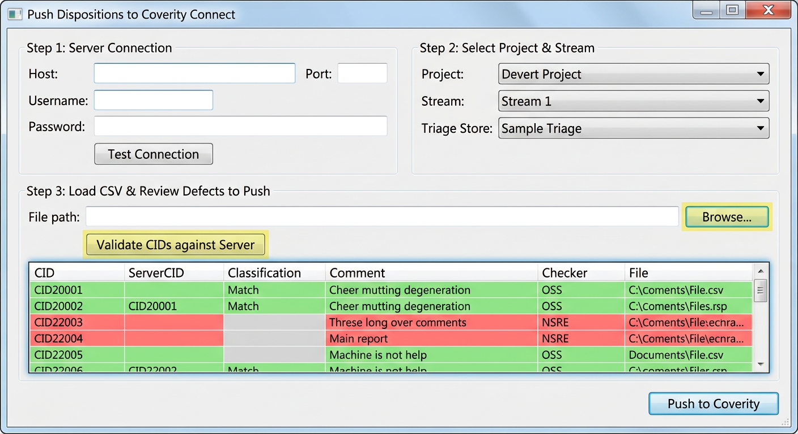

# Coverity Tool Windows Quickstart

Version: 1.4
Audience: Engineers and reviewers using Coverity findings in a Windows desktop flow.

## 1) What this package gives you

- Desktop app to review Coverity findings and assign dispositions.
- Local processing workflow (no source upload by this tool).
- Pull from Coverity Connect, analyze, review, and push updates.

## 2) Where the exe is

After build, the executable is here:

- dist/CoverityTool/CoverityTool.exe

Important:

- Keep CoverityTool.exe together with the _internal folder.
- Do not move only the exe file by itself.

## 3) Prerequisites

- Windows 10 or Windows 11 (64-bit).
- Network access to your Coverity Connect server.
- Valid Coverity account with project/stream visibility.

## 4) Launch the tool

- Open dist/CoverityTool.
- Double-click CoverityTool.exe.

## 5) Screen-by-screen workflow

### Step A: Setup page

Use this page to select inputs, source root, and output folder.

What to enter:

- Source input: Coverity HTML report folder or Excel export.
- Source Code Root: Local source tree used for context extraction.
- Output folder: Destination for CSV, logs, and pull exports.

### Step B: Pull defects from server (optional)

Use Pull when you want current defects directly from Coverity Connect.

What to enter:

- Host, Port, Username, Password.
- Project and Stream after successful connection test.
- Output file path for pulled data.

### Step C: Run analysis

Start analysis from Setup after input paths are ready.

What you get:

- Classification for each defect.
- Confidence score and evidence comments.
- Suggested remediation text.

### Step D: Review results

Use Results to filter, inspect, and finalize decisions.

Reviewer actions:

- Filter by classification and checker category.
- Open a finding to review context and reasoning.
- Accept or override a suggested disposition.

### Step E: Inspect details

Use the detail pane for file, line, function, and evidence trace.

### Step F: Push dispositions back to Coverity

Push reviewed decisions to Coverity Connect.

Before push:

- Confirm project and triage store.
- Validate CIDs against server.
- Use dry run if you want a non-writing verification first.

## 6) Output files you will see

In your selected output folder:

- coverity_dispositions.csv: Tool-generated suggestions.
- coverity_final_decisions.csv: Reviewer-approved final decisions.
- audit.jsonl: Detailed run and decision trail.
- coverity_pull_<stream>_<timestamp>.xlsx: Pull export from server.

## 7) Common issues and quick fixes

- App does not start:
  - Ensure CoverityTool.exe and _internal are in the same folder.
- Connection fails:
  - Verify host, port, credentials, and network access.
  - Confirm account access to selected project/stream.
- No findings after analysis:
  - Recheck input path and report format.
  - Recheck source root path alignment with report files.

## 8) Minimum user data checklist

Collect this before first use:

- Coverity server host and port.
- Username and password (or approved enterprise access method).
- Project name and stream name.
- Local report path (if not pulling from server).
- Local source root path.
